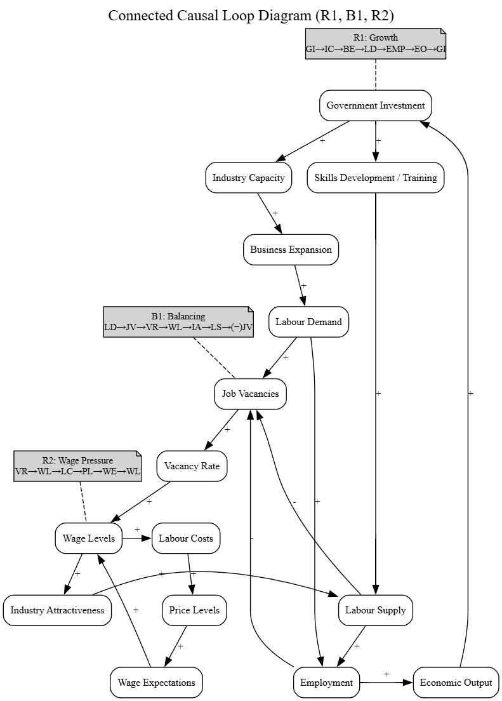

# Labour Investments Decison Making Nationally and Provincially
A decision support analysis to decide what industries require more investment within Canada

## Decision Statement 

Which industries should receive more or less government investment (subsidies, training, tax credits) based on national trends in job vacancies and employment and wages?

## Decisions Maker 

Provincial and Federal Ministers of Labour [Full List](https://github.com/jwright131/labour-investment/blob/main/BACKGROUND.md#decision-maker)

## Executive Summary

Governments in Canada must regularly decide which industries should receive priority for public investment through training programs, subsidies, and workforce development initiatives. These decisions matter because they directly influence employment levels, wage growth, and long-term economic stability. Targeting investment toward industries with the greatest labour shortages or growth potential can help ensure that public funds are used efficiently and that essential sectors such as healthcare, construction, and clean technology have the workers they need to function and expand. Because Canada’s economy varies widely across provinces and territories, these choices also shape regional development and can either reduce or deepen existing economic inequalities.

This decision is particularly important because labour markets are changing rapidly due to demographic aging, technological change, and climate-related transitions in industry. Shortages in key sectors can delay housing construction, strain healthcare systems, and limit economic growth, while overinvestment in declining industries can leave workers without viable job prospects. Federal and provincial employment ministers must therefore balance short-term labour needs with long-term economic goals, using labour market data to identify where investment will have the greatest impact. By grounding industry investment decisions in employment, vacancy, and wage trends at both the national and provincial levels, policymakers can better align training and funding priorities with actual labour market conditions and improve outcomes for workers, employers, and taxpayers.

## Causal Loop Diagram Draft

The causal loop diagram (CLD) illustrates how key labour market variables interact to influence employment outcomes by industry. It shows a reinforcing loop in which higher employment growth increases employment levels, leading to greater industry concentration and higher vacancy pressure, which raises wages and further stimulates growth. At the same time, a balancing loop captures how rising employment reduces unemployment and vacancy pressure, which dampens wage growth and slows future employment growth. Together, these loops demonstrate how labour markets can both accelerate and stabilize over time, highlighting why policy interventions must account for feedback effects rather than isolated trends.

# Milestone Two Additions

## Summary of Datasets

The four datasets used in this analysis collectively capture key dimensions of Canada’s labour market and economic structure. The Employee Count dataset provides annual employment levels by province and industry, offering insight into the size and regional distribution of the workforce. The Job Vacancy and Payroll dataset supplies monthly industry-level data on job vacancies, payroll employment, and vacancy rates, allowing for analysis of labour demand pressures and workforce tightness over time. The Employee Wage dataset contributes wage information by industry and period, supporting examination of compensation trends and their relationship to labour supply and vacancy dynamics. Finally, the Government Investment dataset details public investment by industry, enabling evaluation of how policy-driven funding may influence industry capacity, employment growth, and broader economic output. Together, these datasets provide a comprehensive foundation for analyzing interactions between investment, employment, wages, and labour market demand.

## Causal Loop Diagram Refined

The causal loop diagram illustrates how government investment interacts with labour market dynamics through reinforcing and balancing feedback mechanisms. Government investment increases industry capacity and business expansion, which raises labour demand. When labour demand exceeds labour supply, job vacancies and the vacancy rate increase, placing upward pressure on wages as employers compete for workers. Higher wages increase industry attractiveness and encourage additional labour supply, helping reduce vacancies over time in a balancing feedback loop. At the same time, rising employment contributes to stronger economic output, which can support additional government investment and reinforce economic growth. A second reinforcing loop captures how sustained vacancy pressure increases wages, raising labour costs and shaping broader wage expectations within the economy.

Empirical evidence supports the key causal relationships in the diagram. Recent federal workforce policy announcements emphasize investment in skills training and workforce development to address labour shortages, supporting the link between government investment and increased labour supply and industry capacity ([Government of Canada, 2025](https://www.canada.ca/en/employment-social-development/news/2025/10/backgrounder-on-measures-introduced-to-build-a-strong-and-confident-workforce.html)). National labour market reporting highlights how shifts in job vacancies are closely tied to wage movements, reinforcing the positive relationship between vacancy rates and wage levels ([Statistics Canada, 2025](https://www150.statcan.gc.ca/n1/daily-quotidien/251216/dq251216a-eng.htm)). In addition, the Bank of Canada’s Monetary Policy Report discusses how labour market tightness contributes to wage growth and broader economic conditions, supporting the reinforcing relationship between employment, wage pressures, and economic output ([Bank of Canada, 2025](https://www.bankofcanada.ca/publications/mpr/)). Together, these sources provide external validation for the polarity signs and feedback loops depicted in the causal loop diagram.

