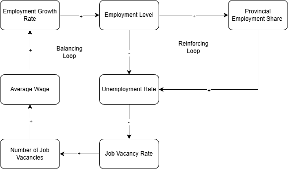

# Labour Investments Decison Making Nationally and Provincially
A decision support analysis to decide what industries require more investment within Canada

## Decision Statement 

Which industries should receive more or less government investment (subsidies, training, tax credits) based on national trends in job vacancies and employment and wages?

## Decisions Maker 

Provincial and Federal Ministers of Labour [Full List](https://github.com/jwright131/labour-investment/blob/main/BACKGROUND.md#decision-maker)

## Executive Summary

Governments in Canada must regularly decide which industries should receive priority for public investment through training programs, subsidies, and workforce development initiatives. These decisions matter because they directly influence employment levels, wage growth, and long-term economic stability. Targeting investment toward industries with the greatest labour shortages or growth potential can help ensure that public funds are used efficiently and that essential sectors such as healthcare, construction, and clean technology have the workers they need to function and expand. Because Canada’s economy varies widely across provinces and territories, these choices also shape regional development and can either reduce or deepen existing economic inequalities.

This decision is particularly important because labour markets are changing rapidly due to demographic aging, technological change, and climate-related transitions in industry. Shortages in key sectors can delay housing construction, strain healthcare systems, and limit economic growth, while overinvestment in declining industries can leave workers without viable job prospects. Federal and provincial employment ministers must therefore balance short-term labour needs with long-term economic goals, using labour market data to identify where investment will have the greatest impact. By grounding industry investment decisions in employment, vacancy, and wage trends at both the national and provincial levels, policymakers can better align training and funding priorities with actual labour market conditions and improve outcomes for workers, employers, and taxpayers.

## Causal Loop Diagram

The causal loop diagram (CLD) illustrates how key labour market variables interact to influence employment outcomes by industry. It shows a reinforcing loop in which higher employment growth increases employment levels, leading to greater industry concentration and higher vacancy pressure, which raises wages and further stimulates growth. At the same time, a balancing loop captures how rising employment reduces unemployment and vacancy pressure, which dampens wage growth and slows future employment growth. Together, these loops demonstrate how labour markets can both accelerate and stabilize over time, highlighting why policy interventions must account for feedback effects rather than isolated trends.

