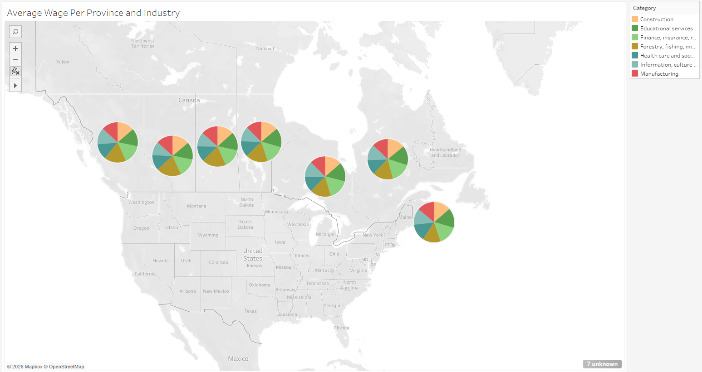
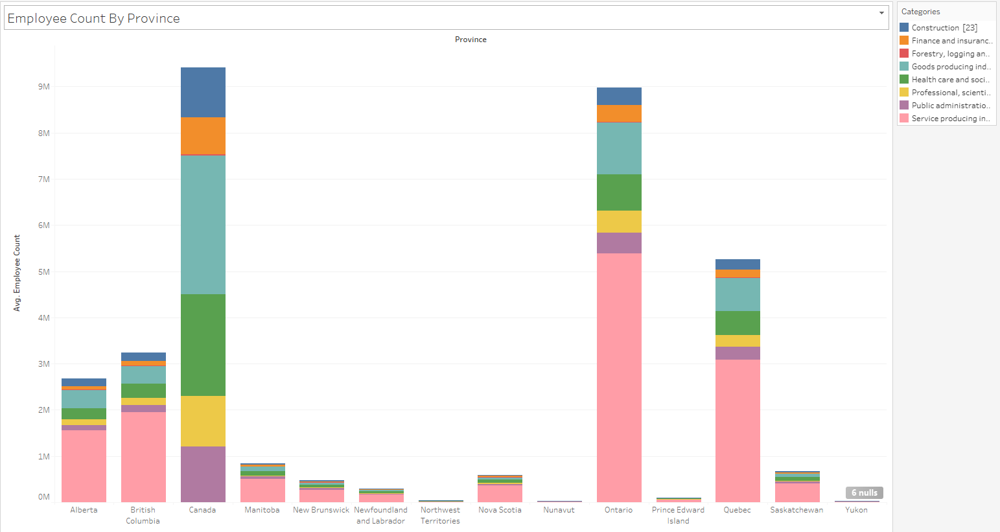
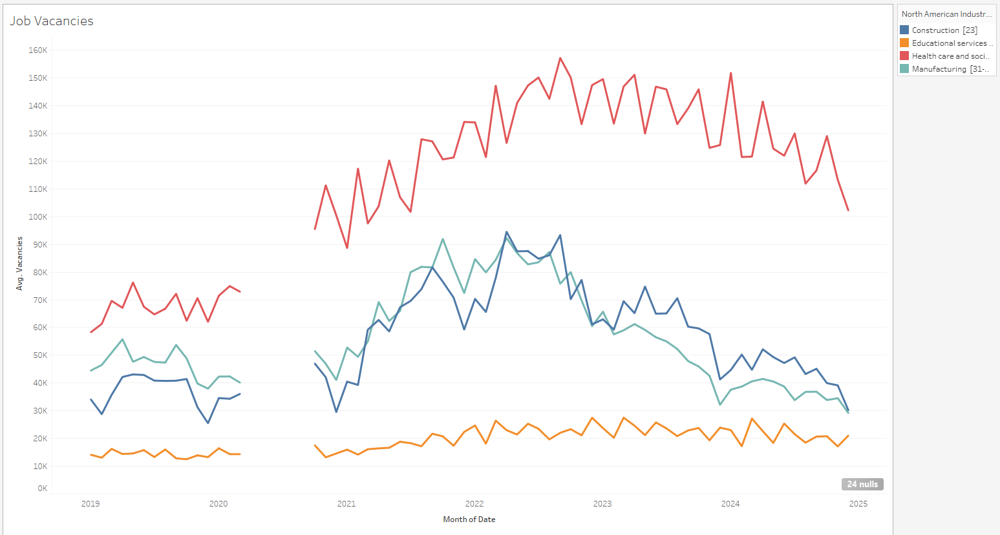

# Labour Investments Decison Making Nationally and Provincially
A decision support analysis to decide what industries require more investment within Canada

## Decision Statement 

Which industries should receive more or less government investment (subsidies, training, tax credits) based on national trends in job vacancies and employment and wages?

## Decisions Maker 

Provincial and Federal Ministers of Labour [Full List](https://github.com/jwright131/labour-investment/blob/main/BACKGROUND.md#decision-maker)

## Executive Summary

Governments in Canada must regularly decide which industries should receive priority for public investment through training programs, subsidies, and workforce development initiatives. These decisions matter because they directly influence employment levels, wage growth, and long-term economic stability. Targeting investment toward industries with the greatest labour shortages or growth potential can help ensure that public funds are used efficiently and that essential sectors such as healthcare, construction, and clean technology have the workers they need to function and expand. Because Canada’s economy varies widely across provinces and territories, these choices also shape regional development and can either reduce or deepen existing economic inequalities.

This decision is particularly important because labour markets are changing rapidly due to demographic aging, technological change, and climate-related transitions in industry. Shortages in key sectors can delay housing construction, strain healthcare systems, and limit economic growth, while overinvestment in declining industries can leave workers without viable job prospects. Federal and provincial employment ministers must therefore balance short-term labour needs with long-term economic goals, using labour market data to identify where investment will have the greatest impact. By grounding industry investment decisions in employment, vacancy, and wage trends at both the national and provincial levels, policymakers can better align training and funding priorities with actual labour market conditions and improve outcomes for workers, employers, and taxpayers.

## Causal Loop Diagram Draft

The causal loop diagram (CLD) illustrates how key labour market variables interact to influence employment outcomes by industry. It shows a reinforcing loop in which higher employment growth increases employment levels, leading to greater industry concentration and higher vacancy pressure, which raises wages and further stimulates growth. At the same time, a balancing loop captures how rising employment reduces unemployment and vacancy pressure, which dampens wage growth and slows future employment growth. Together, these loops demonstrate how labour markets can both accelerate and stabilize over time, highlighting why policy interventions must account for feedback effects rather than isolated trends.

# Milestone Two Additions

## Summary of Datasets

The four datasets used in this analysis collectively capture key dimensions of Canada’s labour market and economic structure. The Employee Count dataset provides annual employment levels by province and industry, offering insight into the size and regional distribution of the workforce. The Job Vacancy and Payroll dataset supplies monthly industry-level data on job vacancies, payroll employment, and vacancy rates, allowing for analysis of labour demand pressures and workforce tightness over time. The Employee Wage dataset contributes wage information by industry and period, supporting examination of compensation trends and their relationship to labour supply and vacancy dynamics. Finally, the Government Investment dataset details public investment by industry, enabling evaluation of how policy-driven funding may influence industry capacity, employment growth, and broader economic output. Together, these datasets provide a comprehensive foundation for analyzing interactions between investment, employment, wages, and labour market demand.

## Causal Loop Diagram Refined

The causal loop diagram illustrates how government investment interacts with labour market dynamics through reinforcing and balancing feedback mechanisms. Government investment increases industry capacity and business expansion, which raises labour demand. When labour demand exceeds labour supply, job vacancies and the vacancy rate increase, placing upward pressure on wages as employers compete for workers. Higher wages increase industry attractiveness and encourage additional labour supply, helping reduce vacancies over time in a balancing feedback loop. At the same time, rising employment contributes to stronger economic output, which can support additional government investment and reinforce economic growth. A second reinforcing loop captures how sustained vacancy pressure increases wages, raising labour costs and shaping broader wage expectations within the economy.

Empirical evidence supports the key causal relationships in the diagram. Recent federal workforce policy announcements emphasize investment in skills training and workforce development to address labour shortages, supporting the link between government investment and increased labour supply and industry capacity ([Government of Canada, 2025](https://www.canada.ca/en/employment-social-development/news/2025/10/backgrounder-on-measures-introduced-to-build-a-strong-and-confident-workforce.html)). National labour market reporting highlights how shifts in job vacancies are closely tied to wage movements, reinforcing the positive relationship between vacancy rates and wage levels ([Statistics Canada, 2025](https://www150.statcan.gc.ca/n1/daily-quotidien/251216/dq251216a-eng.htm)). In addition, the Bank of Canada’s Monetary Policy Report discusses how labour market tightness contributes to wage growth and broader economic conditions, supporting the reinforcing relationship between employment, wage pressures, and economic output ([Bank of Canada, 2025](https://www.bankofcanada.ca/publications/mpr/)). Together, these sources provide external validation for the polarity signs and feedback loops depicted in the causal loop diagram.

## Visualizations

### Average Wage Per Province Per Industry

This visualization shows how average wages are distributed across provinces and industries, with each pie chart representing the wage composition within a province. Larger provinces such as Ontario, Quebec, Alberta, and British Columbia display a broader distribution of higher-paying sectors like finance, professional services, and manufacturing, while smaller provinces show a heavier concentration in fewer dominant industries. The map highlights regional wage disparities and differences in industry structure, suggesting that provincial economic composition plays a key role in wage levels. For a decision-maker, this reveals where high-value industries are concentrated geographically and where wage growth potential may depend on diversification or targeted investment.

### 2024 Investment By Industry

This chart compares total government investment across industries in 2024. Mining, quarrying, and oil and gas extraction, along with transportation, manufacturing, and public administration, receive the highest levels of investment, while industries such as management of companies, accommodation and food services, and other service sectors receive significantly less. The clear variation across industries indicates prioritization in capital allocation. For a decision-maker, this visualization helps assess whether investment is aligned with strategic growth sectors and whether funding patterns correspond to employment size, labour shortages, or economic importance.

### Employee Count By Province

This visualization shows total employment by province, broken down by industry categories. Ontario and Quebec account for the largest share of employment, with strong representation in service-producing industries, while Alberta and British Columbia also maintain substantial employment levels across goods and service sectors. Smaller provinces and territories have comparatively limited workforce sizes and more concentrated industry structures. This chart highlights regional labour market scale and sector distribution, which is critical for understanding where labour supply pressures are likely strongest and where targeted policy interventions may have the greatest impact.

### Job Vacancies

This time-series chart tracks job vacancies from 2019 to 2025 across selected industries and clearly shows a disruption around 2020 corresponding to the COVID-19 period, where vacancy levels either decline sharply or show a visible gap in the data. Following this pandemic-related interruption, vacancies rise significantly in 2021 and peak in 2022, particularly in health care, manufacturing, and construction, before gradually easing through 2024–2025. The post-COVID surge reflects labour shortages during economic reopening and recovery, while the subsequent moderation suggests partial market adjustment. For a decision-maker, this visualization distinguishes between pandemic-driven shocks and more persistent structural shortages, helping determine whether policy responses should focus on temporary stabilization or long-term workforce development.

## Citations

Statistics Canada. (2020). Employment by industry, annual. Government of Canada. https://www150.statcan.gc.ca/t1/tbl1/en/tv.action?pid=1410020201

Statistics Canada. (2020). Job vacancies, payroll employees and job vacancy rate by industry. Government of Canada. https://www150.statcan.gc.ca/t1/tbl1/en/tv.action?pid=1410037201

Statistics Canada. (2020). Average hourly wages of employees by industry. Government of Canada. https://www150.statcan.gc.ca/t1/tbl1/en/tv.action?pid=1410024301

Statistics Canada. (2020). Capital and repair expenditures, non-residential tangible assets, by industry and geography. Government of Canada. https://www150.statcan.gc.ca/t1/tbl1/en/tv.action?pid=3410003501

