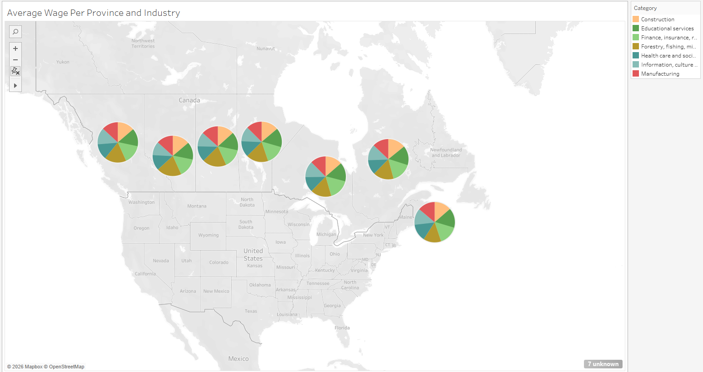
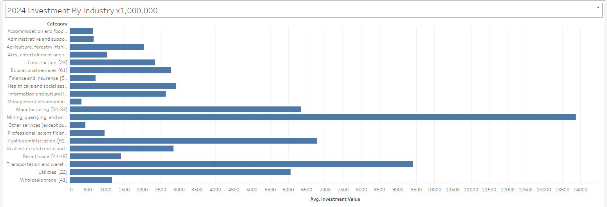
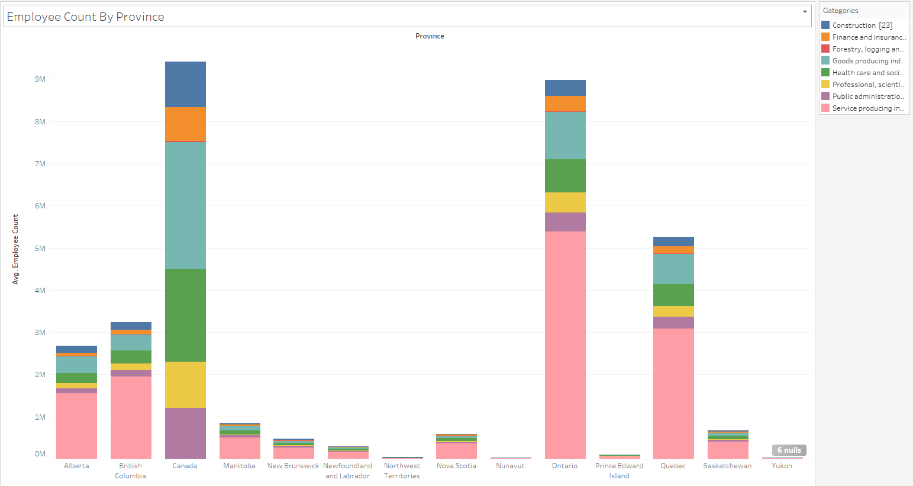
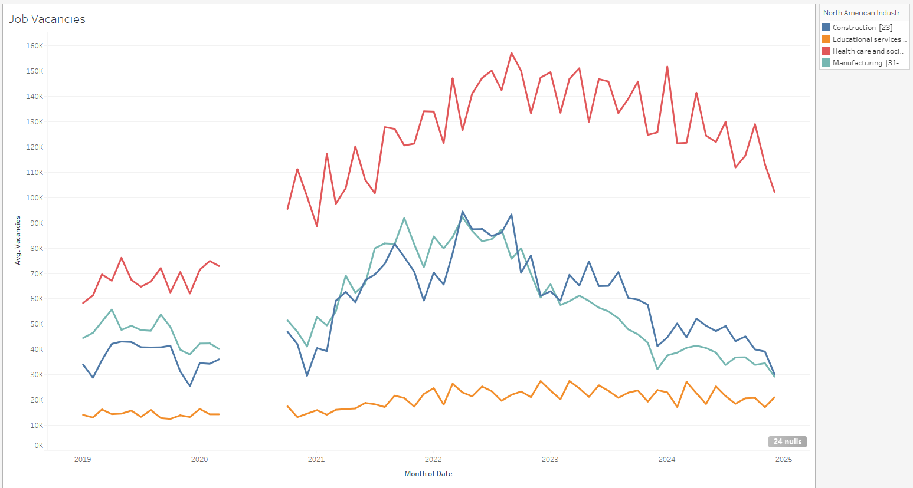
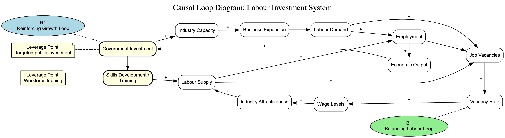

# Labour Investments Decison Making Nationally and Provincially
A decision support analysis to decide what industries require more investment within Canada

## Decision Statement 

Which industries should receive more or less government investment (subsidies, training, tax credits) based on national trends in job vacancies and employment and wages?

## Table of Contents

[Dashboard](#dasboard-link-and-explanation)  
[Decision Makers](#decision-makers)  
[Executive Summary](#executive-summary)  
[Summary of Data](#summary-of-datasets)  
[Visualizations](#visualizations)  
[Analysis](#analysis)  
[Recommendations](#recommendations)  
[Future Work](#future-work)  
[Citations](#citations)  
[Wrangling Process](WRANGLING.md)  
[Data Sets](data/)  
[Detailed Data](data/README.md)  
[Code for Dashboard](src/)  
[Background Statement](BACKGROUND.md)

## Dasboard Link and Explanation

### [Link to Dashboard](https://labour-investment-u2r8x8zjjsvbxu6wqjragn.streamlit.app/)

The dashboard includes built-in instructions directly on the site to guide users on how to navigate the filters, charts, and map features. It is designed to support decision-making by allowing users to explore labour market data in an interactive way. By adjusting filters such as industry, year, and statistics, users can quickly identify trends and patterns that highlight which industries may require increased investment. The interactive design makes complex data easier to understand, helping users make more informed and evidence-based investment decisions.

## Decision Makers 

Provincial and Federal Ministers of Labour [Full List](https://github.com/jwright131/labour-investment/blob/main/BACKGROUND.md#decision-maker)

## Executive Summary

Governments in Canada must regularly decide which industries should receive priority for public investment through training programs, subsidies, and workforce development initiatives. These decisions matter because they directly influence employment levels, wage growth, and long-term economic stability. Targeting investment toward industries with the greatest labour shortages or growth potential can help ensure that public funds are used efficiently and that essential sectors such as healthcare, construction, and clean technology have the workers they need to function and expand. Because Canada’s economy varies widely across provinces and territories, these choices also shape regional development and can either reduce or deepen existing economic inequalities.

This decision is particularly important because labour markets are changing rapidly due to demographic aging, technological change, and climate-related transitions in industry. Shortages in key sectors can delay housing construction, strain healthcare systems, and limit economic growth, while overinvestment in declining industries can leave workers without viable job prospects. Federal and provincial employment ministers must therefore balance short-term labour needs with long-term economic goals, using labour market data to identify where investment will have the greatest impact. By grounding industry investment decisions in employment, vacancy, and wage trends at both the national and provincial levels, policymakers can better align training and funding priorities with actual labour market conditions and improve outcomes for workers, employers, and taxpayers.

## Summary of Datasets

The four datasets used in this analysis collectively capture key dimensions of Canada’s labour market and economic structure. The Employee Count dataset provides annual employment levels by province and industry, offering insight into the size and regional distribution of the workforce. The Job Vacancy and Payroll dataset supplies monthly industry-level data on job vacancies, payroll employment, and vacancy rates, allowing for analysis of labour demand pressures and workforce tightness over time. The Employee Wage dataset contributes wage information by industry and period, supporting examination of compensation trends and their relationship to labour supply and vacancy dynamics. Finally, the Government Investment dataset details public investment by industry, enabling evaluation of how policy-driven funding may influence industry capacity, employment growth, and broader economic output. Together, these datasets provide a comprehensive foundation for analyzing interactions between investment, employment, wages, and labour market demand.

## Visualizations

### Average Wage Per Province Per Industry

This visualization shows how average wages are distributed across provinces and industries, with each pie chart representing the wage composition within a province. Larger provinces such as Ontario, Quebec, Alberta, and British Columbia display a broader distribution of higher-paying sectors like finance, professional services, and manufacturing, while smaller provinces show a heavier concentration in fewer dominant industries. The map highlights regional wage disparities and differences in industry structure, suggesting that provincial economic composition plays a key role in wage levels. For a decision-maker, this reveals where high-value industries are concentrated geographically and where wage growth potential may depend on diversification or targeted investment.

### 2024 Investment By Industry

This chart compares total government investment across industries in 2024. Mining, quarrying, and oil and gas extraction, along with transportation, manufacturing, and public administration, receive the highest levels of investment, while industries such as management of companies, accommodation and food services, and other service sectors receive significantly less. The clear variation across industries indicates prioritization in capital allocation. For a decision-maker, this visualization helps assess whether investment is aligned with strategic growth sectors and whether funding patterns correspond to employment size, labour shortages, or economic importance.

### Employee Count By Province

This visualization shows total employment by province, broken down by industry categories. Ontario and Quebec account for the largest share of employment, with strong representation in service-producing industries, while Alberta and British Columbia also maintain substantial employment levels across goods and service sectors. Smaller provinces and territories have comparatively limited workforce sizes and more concentrated industry structures. This chart highlights regional labour market scale and sector distribution, which is critical for understanding where labour supply pressures are likely strongest and where targeted policy interventions may have the greatest impact.

### Job Vacancies

This time-series chart tracks job vacancies from 2019 to 2025 across selected industries and clearly shows a disruption around 2020 corresponding to the COVID-19 period, where vacancy levels either decline sharply or show a visible gap in the data. Following this pandemic-related interruption, vacancies rise significantly in 2021 and peak in 2022, particularly in health care, manufacturing, and construction, before gradually easing through 2024–2025. The post-COVID surge reflects labour shortages during economic reopening and recovery, while the subsequent moderation suggests partial market adjustment. For a decision-maker, this visualization distinguishes between pandemic-driven shocks and more persistent structural shortages, helping determine whether policy responses should focus on temporary stabilization or long-term workforce development.

## Causal Loop Diagram

The causal loop diagram illustrates the dynamic relationships between government investment, labour market conditions, and economic performance in order to identify where policy intervention can most effectively improve workforce outcomes. The system begins with **government investment**, which acts as a primary leverage point influencing both **industry capacity** and **skills development**. Increased investment allows industries to expand infrastructure, technology, and productive capabilities, leading to **business expansion** and increased **labour demand**. As demand for workers grows, **employment** rises, contributing to greater **economic output**, which in turn supports continued or increased government investment. This creates the first feedback loop, labeled **R1 (Reinforcing Growth Loop)**, where economic growth and employment mutually strengthen one another over time. This loop demonstrates how strategic investment can create long-term economic expansion and job creation when aligned with industry needs.

The second feedback loop, labeled **B1 (Balancing Labour Loop)**, explains how labour markets adjust when demand for workers exceeds supply. As labour demand increases, **job vacancies** rise, resulting in a higher **vacancy rate**. A higher vacancy rate signals labour shortages and places upward pressure on **wage levels** as firms compete for employees. Higher wages increase **industry attractiveness**, encouraging more workers to enter the labour market or shift toward higher-demand industries, increasing **labour supply**. As labour supply grows, job vacancies begin to decline, helping stabilize the system. This balancing loop demonstrates how wage adjustments help correct labour shortages over time.

The diagram highlights **government investment** and **skills development** as key leverage points because they influence both loops simultaneously. Investment targeted toward workforce training increases labour supply directly, reducing persistent vacancy rates and helping industries grow sustainably without excessive wage inflation. Without sufficient labour supply, increased investment may only increase labour demand, worsening shortages and raising costs. By improving workforce skills and supporting productive capacity at the same time, policy-makers can promote stable employment growth and long-term economic output. Overall, the diagram demonstrates that coordinated investment in both industry development and labour supply is necessary to create a balanced and sustainable labour market system.

## Analysis

The analysis suggests that labour shortages in several industries are influenced not only by levels of investment but also by the availability of skilled workers. The data shows that industries with consistently high job vacancy rates often also experience rising wages, indicating that employers are competing for a limited pool of workers. This pattern suggests that labour supply constraints play an important role in shaping employment outcomes. At the same time, industries receiving higher levels of investment do not always demonstrate proportionally higher employment growth, implying that investment alone may not fully resolve workforce challenges. The causal loop analysis reinforces this finding by showing that increasing investment without addressing labour supply can lead to higher labour demand and wage pressure, rather than sustainable employment growth.

Based on this evidence, policy approaches that combine industry investment with workforce development appear more promising than strategies focused solely on increasing funding to industries. Options that support training programs, education partnerships, and skills development are likely to improve labour market stability by helping supply adjust to demand. In contrast, approaches that increase investment without addressing workforce constraints may worsen labour shortages or lead to higher labour costs without significantly improving employment outcomes.

Some uncertainty remains due to the possibility that labour market conditions may change in response to economic cycles, technological shifts, or external shocks similar to the COVID-19 disruption observed in the data. Additionally, limitations in the available data prevent a fully detailed assessment of skill-specific shortages across industries. Despite these uncertainties, the evidence suggests that balanced investment strategies addressing both industry capacity and workforce skills are most likely to produce stable long-term results. Milestone 4 will build on these findings by presenting a specific recommendation for how investment can be directed to maximize employment growth while minimizing persistent labour shortages.

## Recommendations

The analysis indicates that targeted labour-related investment should focus on industries and provinces experiencing persistent labour shortages, high vacancy rates, and strong employment demand. Based on the evidence from the dashboard and causal loop analysis, three promising options for investment include Health Care and Social Assistance in Ontario, Construction in British Columbia, and Manufacturing in Quebec. These industries demonstrate relatively high job vacancy rates alongside strong employment levels, suggesting that labour demand continues to exceed available labour supply. The data also shows that wages in these sectors have increased over time, which supports the conclusion that employers are competing for workers but are still facing difficulty filling positions. This indicates that workforce constraints may be limiting potential economic growth within these industries.

Among these options, investment strategies that combine funding for industry expansion with workforce training programs appear more promising than approaches that only increase financial investment without addressing labour supply. For example, targeted training programs, apprenticeships, or partnerships with educational institutions could help increase the number of qualified workers entering these industries. Options that focus solely on increasing industry funding without improving labour supply may lead to increased wage pressure without significantly reducing vacancy rates.

There is still uncertainty related to how future economic conditions, technological changes, or policy adjustments may affect labour demand in these industries. Additionally, some labour shortages may be temporary or influenced by external factors such as migration patterns or economic cycles. Despite these uncertainties, the current evidence suggests that focusing investment on these three industry–province combinations is likely to improve employment outcomes and reduce labour shortages. Milestone 4 will present a final recommendation selecting the most effective option among these alternatives.

## Future Work

Future improvements to the dashboard could expand both the depth of analysis and the usefulness of the tool for decision-makers. One important enhancement would be the inclusion of more detailed labour market indicators, such as unemployment rates by industry, labour force participation rates, and data on job tenure or worker turnover. These variables would provide a more complete understanding of labour supply dynamics and help distinguish between short-term labour shortages and longer-term structural issues. Adding data on education levels or skill requirements by industry could also strengthen the ability to identify where targeted training programs would be most effective.

Another potential improvement would be the integration of regional comparisons at a more detailed geographic level, such as census metropolitan areas, rather than only provincial summaries. This would allow decision-makers to identify local labour shortages and better allocate resources based on regional needs. The dashboard could also benefit from additional time series data to better evaluate long-term trends and cyclical patterns, improving the reliability of forecasts and investment decisions.

Finally, interactive scenario tools could be added to allow users to simulate how changes in investment levels or labour supply might influence vacancy rates and employment outcomes. This would transform the dashboard from a descriptive tool into a more predictive decision-support system.

## Citations

Statistics Canada. (2020). Employment by industry, annual. Government of Canada. https://www150.statcan.gc.ca/t1/tbl1/en/tv.action?pid=1410020201

Statistics Canada. (2020). Job vacancies, payroll employees and job vacancy rate by industry. Government of Canada. https://www150.statcan.gc.ca/t1/tbl1/en/tv.action?pid=1410037201

Statistics Canada. (2020). Average hourly wages of employees by industry. Government of Canada. https://www150.statcan.gc.ca/t1/tbl1/en/tv.action?pid=1410024301

Statistics Canada. (2020). Capital and repair expenditures, non-residential tangible assets, by industry and geography. Government of Canada. https://www150.statcan.gc.ca/t1/tbl1/en/tv.action?pid=3410003501

